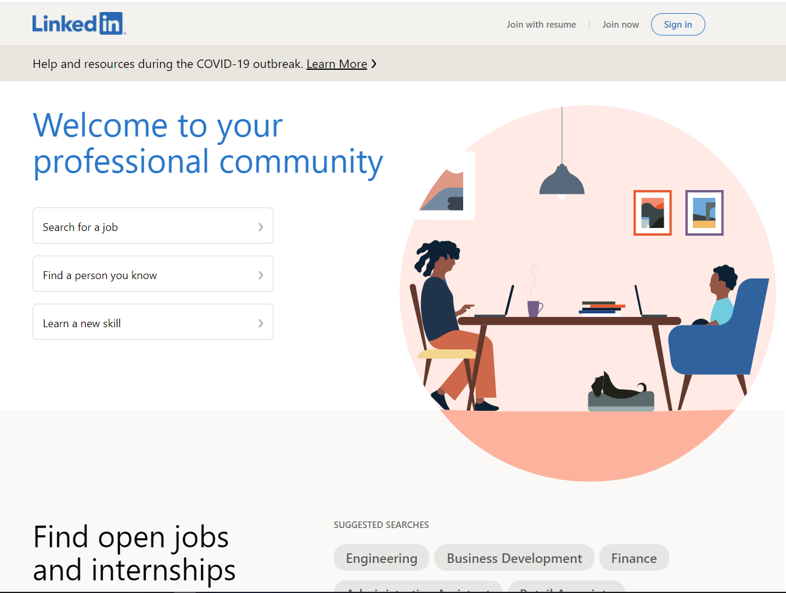
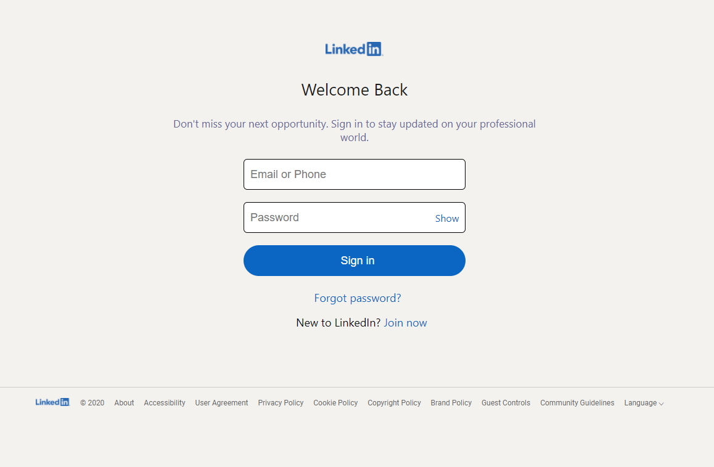
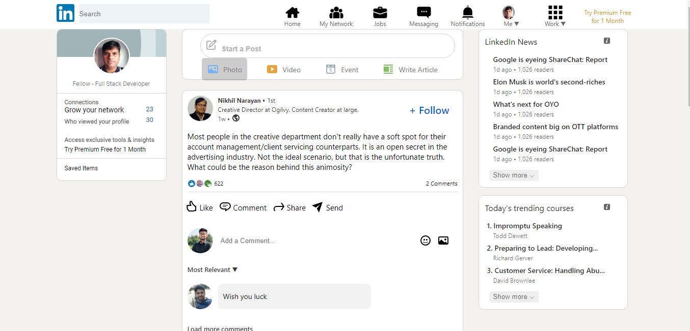

# Methane

<h2 align="center">LinkedIn clone.</h2>
Has functionality of Signin, creating a post and commenting on a post.

<h3>SCREENSHOTS</h3>
<h4>Landing Page</h4>



<h4>SignIn Page</h4>



<h4>Dashboard</h4>



## Built With
- HTML and CSS.
- Javascript.
- NodeJS
- React, React DOM
- Styled Components
- Axios
- JSON-Server

## Usage

```bash
npm start
json-server --watch db.json --port 8000
```


### For developers
Clone the source locally:
```sh
$ git clone https://github.com/wahed2102/Methane.git
```
## Contributing
Pull requests are welcome. For major changes, please open an issue first to discuss what you would like to change.

Please make sure to update tests as appropriate.
